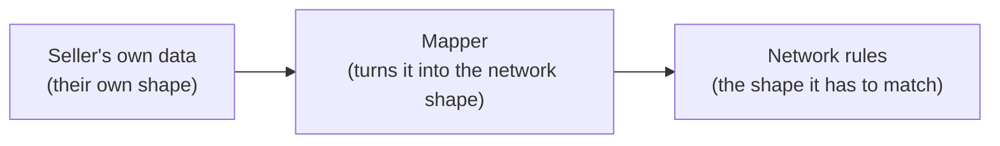

# How this works

This explains everything in this folder — what problem it checks, every file, what each block of code does, and what running it actually proves. Written so someone with zero background on this can follow it start to end.

## The problem, in plain words

A seller (an "NP" — network participant) has their own system: their own product list, their own order records, in whatever shape they already store it. To talk to a buyer app over the network, that data has to be turned into a fixed, agreed shape — the Beckn protocol shape. That fixed shape can change over time — the network might add a new field, or rename an old one.

The question this whole folder answers: **when that shape changes, does the seller's own system have to change too? Or can it stay exactly as it is?**

Picture three things, one feeding into the next:



The goal: when the box on the right changes, only the middle box should need to change. The box on the left — the seller's own data — should never have to.

This is checked here using **real data** (a real, live Shopify store) and **real rules** (the actual Beckn spec files), not made-up examples. Kept as its own separate folder on purpose, not built inside the main seller backend — proving something can stand on its own is more convincing if it actually does stand on its own.

## Everything needed to run this

- Node.js installed
- A `.env` file with `SHOPIFY_SHOP` and `SHOPIFY_ADMIN_API_TOKEN` (copy `.env.example` and fill in real values — never committed to GitHub)
- `npm install` once, in this folder

---

## File by file

### `.env.example`

A template showing which two settings are needed. The real `.env` (with the real store name and real access token) is never pushed to GitHub — it's in `.gitignore`.

### `.gitignore`

Keeps three things off GitHub: `node_modules/` (installed libraries, not source code), `.env` (secrets), and `logs/` (output from running the tests — regenerated every run, not something that needs to live in git history).

### `package.json`

Lists what this project depends on:
- `axios` — for making real HTTP calls (to Shopify's API, and to the mock webhook)
- `dotenv` — reads the `.env` file
- `js-yaml` — reads the real spec files, which are written in YAML
- `ajv` and `ajv-formats` — the actual engine that checks a piece of data against a schema (a "rule file"). `ajv-formats` adds support for things like checking that a field is a real UUID.
- `express` — a tiny web server library, used for the mock BAP webhook

---

### `fetch-shopify-data.js` — getting the seller's real data

This is step one: get real data, not made-up data.

**Block 1 — setup**
```js
require("dotenv").config();
const fs = require("fs");
const path = require("path");
const axios = require("axios");

const shop = process.env.SHOPIFY_SHOP;
const token = process.env.SHOPIFY_ADMIN_API_TOKEN;
```
Reads the store name and access token from `.env`. If either is missing, the script stops immediately with a clear error, rather than failing confusingly later.

**Block 2 — the actual fetch**
```js
const { data } = await axios.get(
  `https://${shop}.myshopify.com/admin/api/2024-10/products.json?limit=250`,
  { headers: { "X-Shopify-Access-Token": token } }
);
```
One real HTTP call to Shopify's own API, asking for every product (up to 250 — this store only has 17, so one call gets everything). `X-Shopify-Access-Token` is how Shopify checks the request is allowed.

**Block 3 — save it**
```js
fs.writeFileSync(OUT_PATH, JSON.stringify(products, null, 2));
```
Writes the raw response, exactly as Shopify sent it, to `data/shopify-raw-products.json`. Nothing is removed or reshaped here — this is the true starting point, the seller's own data in the seller's own shape.

**Run it:**
```bash
node fetch-shopify-data.js
```

**Note:** `data/` is not pushed to GitHub (it's real store data, and it's easy to regenerate by just running this again).

---

### `schemas/beckn2.yaml` and `schemas/beckn3.yaml` — the real rules

These are complete, real spec files — not summaries, not hand-picked pieces.

- `beckn2.yaml` — the actual, current, real Beckn v2.0.0 spec.
- `beckn3.yaml` — the same spec, with one small made-up addition: a new field called `catalogSummary`, and one field renamed (`performance` becomes `progress`). There is no real "Beckn v3.0.0" — this file is a stand-in for "what happens when the rules change," built specifically to have one new field, one renamed field, so there's something real to test against.

Kept as full files (not trimmed down) because schemas inside them refer to each other — a `Catalog` schema points at a `Resource` schema, which points at other things. Cutting a piece out by hand risks breaking those links or missing something. Loading the whole file means everything still connects correctly.

---

### `check-schema.js` — the actual rule-checker

This is the tool that answers "does this data actually match the rules or not" — for real, not just by eye.

**Block 1 — load one of the real spec files**
```js
function loadValidator(specPath, schemaName) {
  const doc = yaml.load(fs.readFileSync(specPath, "utf-8"));
  const ajv = new Ajv({ strict: false, allErrors: true });
  addFormats(ajv);

  ajv.addSchema(doc, "spec");
  return ajv.compile({ $ref: `spec#/components/schemas/${schemaName}` });
}
```
Reads the whole YAML file into memory, registers it with `ajv` (the checking engine), and points at one specific named rule inside it — for example `OnDiscoverAction`. Because the whole file was registered, any other rule that one refers to (like `Catalog`, or `Resource`) resolves correctly too.

**Block 2 — run the check**
```js
function check(specPath, schemaName, data) {
  const validate = loadValidator(specPath, schemaName);
  const valid = validate(data);
  return { valid, errors: validate.errors };
}
```
Takes a piece of data, checks it against the named rule, and returns whether it passed, plus the exact list of problems if it didn't. Every other file in this folder that needs to check something calls this function — it's the single source of truth for "is this actually correct."

---

### `mapper/shared.js` — turning one product into Beckn shape

The part of the mapping that is identical whether targeting v2.0.0 or v3.0.0 — converting one raw Shopify product into a `Resource` and an `Offer`.

**Block 1 — cleaning up text**
```js
function stripHtml(html) {
  if (!html) return undefined;
  const text = html.replace(/<[^>]*>/g, " ").replace(/\s+/g, " ").trim();
  return text || undefined;
}
```
Shopify product descriptions come as HTML (`<p>...</p>`). This strips the tags down to plain text, since the Beckn shape just wants a description string.

**Block 2 — the actual conversion**
```js
function mapProductToResourceAndOffer(product, currency) {
  const resource = {
    id: `resource-shopify-${product.id}`,
    descriptor: {
      name: product.title,
      longDesc: stripHtml(product.body_html),
      thumbnailImage: product.images?.[0]?.src,
    },
    resourceAttributes: { ... }
  };

  const offer = {
    id: `offer-shopify-${product.id}`,
    descriptor: { name: product.title },
    resourceIds: [resource.id],
    considerations: [ ... price info ... ],
  };

  return { resource, offer };
}
```
One Shopify product becomes two Beckn objects: a `Resource` (the thing being sold) and an `Offer` (the price and terms). Field by field, this is genuinely the "translation" step — Shopify's `title` becomes Beckn's `descriptor.name`, Shopify's `variants[0].price` becomes Beckn's price info, and so on.

---

### `mapper/contract-shared.js` — turning one order into Beckn shape

The same idea as `shared.js`, but for orders instead of products. Used by `select`, `init`, `confirm`, `status`, and `cancel` — every action after `discover` deals with a specific order, not the whole catalog.

**Block 1 — a real mapping table**
```js
const SETTLEMENT_STATUS_MAP = {
  NOT_PAID: "DRAFT",
  PENDING: "COMMITTED",
  PARTIALLY_PAID: "COMMITTED",
  PAID: "COMPLETE",
  REFUNDED: "COMPLETE",
  FAILED: "DRAFT",
};
```
The real Beckn spec has a specific, limited list of allowed values for a settlement's status (`DRAFT`, `COMMITTED`, `COMPLETE`). This table connects a more everyday payment status (like `PAID`) to the one Beckn actually allows.

**Block 2 — building the Contract**
```js
function buildContract(order, product, currency, options) {
  const { resource, offer } = mapProductToResourceAndOffer(product, currency);
  const { transactionId, contractId, quantity, buyer } = order;
  const price = Number(product.variants?.[0]?.price ?? 0) * quantity;

  const contract = {
    id: contractId,
    status: options.contractStatus,
    commitments: [ ... ],
    consideration: [ ... ],
    participants: [ ... ],
  };
  ...
}
```
Takes the seller's own order record (`order`), looks up the actual product being bought, and builds a `Contract` — the object Beckn uses to represent an order at every stage of its life. `options` controls what stage this particular call represents (more on this below).

**Block 3 — settlements and performance, only when relevant**
```js
if (options.settlementStatus) {
  contract.settlements = [ ... ];
}

if (options.performanceStatus) {
  contract.performance = [ ... ];
}
```
Not every action needs payment info or fulfillment info yet — `select` is just a quote, nothing paid, nothing fulfilled. These two blocks only add that data when the calling action actually needs it.

**Why `contractId` comes from the order, not made up here:** the real Beckn rules require a Contract's `id` to be an actual UUID (a specific, formatted kind of unique string). The first version of this code generated an id like `contract-order-sample-9f1c2a` — human-readable, but not a real UUID, and it failed the real check immediately. Fixed by treating the contract's UUID as something the seller's own order system would have already created and stored — so it lives in `fixtures/sample-order.json`, not invented inside the mapper.

---

### `mapper/v1.js` — the whole mapper, targeting today's real rules (v2.0.0)

**Block 1 — finding the right product**
```js
function findProduct(products, productId) {
  const product = products.find((p) => String(p.id) === String(productId));
  if (!product) {
    throw new Error(`No product with id ${productId} in the seller's data`);
  }
  return product;
}
```
Given an order that references a product by id, finds that exact product in the real fetched catalog.

**Block 2 — discover**
```js
function mapDiscover(products, { shop, currency }) {
  const mapped = products.map((product) => mapProductToResourceAndOffer(product, currency));
  return {
    catalogs: [{
      id: `catalog-shopify-${shop}`,
      descriptor: { name: `${shop} — Live Shopify Catalog` },
      ...
      resources: mapped.map((m) => m.resource),
      offers: mapped.map((m) => m.offer),
    }],
  };
}
```
Turns the whole product list into one `Catalog` object, wrapped the way an `on_discover` response needs.

**Block 3 — the five order-based actions**
```js
function mapSelect(order, products, currency) {
  const product = findProduct(products, order.productId);
  const contract = buildContract(order, product, currency, {
    contractStatus: { code: "DRAFT", name: "Quote generated, awaiting init" },
    commitmentStatusCode: "DRAFT",
    considerationStatus: "QUOTED",
  });
  return { contract };
}
```
`mapSelect`, `mapInit`, `mapConfirm`, `mapStatus`, and `mapCancel` all follow this same shape — each just passes different `options` into `buildContract`, representing what that specific stage of the order looks like:

| Action | Contract status | What's included |
|---|---|---|
| select | DRAFT — quote generated | price quote only |
| init | DRAFT — final terms ready | + buyer info, unpaid settlement |
| confirm | ACTIVE — order confirmed | + paid settlement, performance: CONFIRMED |
| status | ACTIVE — order processing | + paid settlement, performance: IN_PROGRESS |
| cancel | CANCELLED | + refunded settlement |

These exact stages and status values are the same ones the real seller backend (`bpp-sandbox-v2`) already uses — not invented fresh here.

**Block 4 — what gets exported**
```js
module.exports = {
  mapCatalog: mapDiscover,
  mapDiscover,
  mapSelect,
  mapInit,
  mapConfirm,
  mapStatus,
  mapCancel,
};
```
`mapCatalog` is kept as another name for `mapDiscover` so older scripts that used the original name still work.

---

### `mapper/v2.js` — the same mapper, targeting the made-up v3.0.0 rules

**Block 1 — the one real transformation rule**
```js
function renameProgress(contract) {
  if (!contract.performance) {
    return contract;
  }
  const { performance, ...rest } = contract;
  return { ...rest, progress: performance };
}
```
If a contract has a `performance` field, rename it to `progress`. If it doesn't (like `select` or `init`, which don't have fulfillment info yet), leave it alone — nothing to rename.

**Block 2 — discover, with the one new field**
```js
function mapDiscover(products, { shop, currency }) {
  ...
  const catalogSummary = catalogs.map(
    (catalog) => `${catalog.descriptor.name}: ${catalog.resources.length} resources, ${catalog.offers.length} offers`
  );
  return { catalogs, catalogSummary };
}
```
Same catalog-building as v1, plus one new field: a short summary sentence per catalog. This is the only action that gets a new field — nothing else returns a catalog, so nothing else needed one.

**Block 3 — the five order-based actions, reusing v1**
```js
function mapSelect(order, products, currency) {
  const { contract } = v1.mapSelect(order, products, currency);
  return { contract: renameProgress(contract) };
}
```
Rather than rebuilding the whole contract from scratch, v2 calls v1's version first (identical logic, identical result), then applies the one rename on top. This is deliberate — it proves the only real difference between the two versions is this one small step, not a full rewrite.

---

### `fixtures/sample-order.json` — a made-up order, using a real product

```json
{
  "transactionId": "order-sample-9f1c2a",
  "contractId": "040ee6b2-4ade-4e3f-86c0-5ba4f328363e",
  "productId": "8735376474306",
  "quantity": 1,
  "buyer": { "name": "Test Buyer", "phone": "+91 90000 00000" },
  "paymentMethod": "UPI"
}
```
This represents the seller's own order record — the kind of thing a real order system would store. `productId` points at one of the real Shopify products already fetched. This is the one piece of data in this whole folder that's genuinely made up (there's no real live order to pull from) — but it's written in a plain, realistic shape, the same way a real order table might look, not shaped anything like Beckn.

---

### `run-mapper-v1.js` and `run-mapper-v2.js` — quick, single-action checks

Both scripts follow the same shape: load the real saved product data, fetch the store's currency (a tiny extra live API call), run just the `discover` mapper, print what it built, and check the result against the matching real schema.

```bash
node run-mapper-v1.js   # checks against beckn2.yaml
node run-mapper-v2.js   # checks against beckn3.yaml
```

Useful for a quick check on just the catalog/discover path without running everything.

---

### `mock-bap-webhook.js` — a stand-in for a real buyer app

```js
app.post("/on_:action", (req, res) => {
  console.log(`\n=== received on_${req.params.action} ===`);
  console.log(JSON.stringify(req.body, null, 2));
  res.status(200).json({ message: { status: "ACK" } });
});
```
A tiny web server, five lines of real logic. Listens on port `4010`. Whatever gets sent to it, on any `/on_<action>` address, it prints out and acknowledges. This stands in for a real buyer app's webhook — the actual destination a seller's response would be delivered to in real life. Using this instead of just checking the data in isolation proves the output isn't just correctly shaped, it's actually deliverable over a real HTTP connection.

```bash
node mock-bap-webhook.js
```
Needs to be running, in its own terminal, before `test-all-actions.js` is run.

---

### `test-all-actions.js` — the full, real test

This is the main script — everything else in this folder leads up to this.

**Block 1 — what it needs**
```js
const PRODUCTS_PATH = ...  // the real fetched product data
const ORDER_PATH = ...      // the sample order
const BECKN2_PATH = ...     // real v2.0.0 rules
const BECKN3_PATH = ...     // the made-up v3.0.0 rules
const WEBHOOK_URL = "http://localhost:4010";
```

**Block 2 — a log file, so nothing is lost after the terminal closes**
```js
function logEntry(entry) {
  fs.appendFileSync(LOG_PATH, JSON.stringify({ timestamp: new Date().toISOString(), ...entry }) + "\n");
}
```
Every single thing checked — what was built, whether it passed, whether it was delivered — gets written as one line to `logs/callbacks.log`. This means the whole run can be reviewed afterward, not just watched scroll past.

**Block 3 — what to test, for each action**
```js
const ACTIONS = {
  discover: ["OnDiscoverAction", "OnDiscoverAction", ...],
  select: ["OnSelectAction", "OnSelectAction", ...],
  init: ["OnInitAction", "OnInitAction", ...],
  confirm: ["OnConfirmAction", "OnConfirmAction", ...],
  status: ["OnStatusAction", "OnStatusAction", ...],
  cancel: ["OnCancelAction", "OnCancelAction", ...],
};
```
One entry per action, naming the exact real schema to check that action's response against, plus which mapper function builds it.

**Block 4 — the actual test, per action**
```js
async function runAction(action, [v2SchemaName, v3SchemaName, v1Fn, v2Fn], products, order, shop, currency) {
  const v1Output = ...;  // build with mapper v1
  const v2Output = ...;  // build with mapper v2, same input

  const v1Check = check(BECKN2_PATH, v2SchemaName, v1Output);
  const v2Check = check(BECKN3_PATH, v3SchemaName, v2Output);
  result(`v1 output matches real v2.0.0 rules`, v1Check.valid);
  result(`v2 output matches real v3.0.0 rules`, v2Check.valid);

  logEntry({ action, version: "v1 (v2.0.0)", output: v1Output, validAgainstRealSchema: v1Check.valid });
  logEntry({ action, version: "v2 (v3.0.0)", output: v2Output, validAgainstRealSchema: v2Check.valid });

  const { data, status } = await axios.post(`${WEBHOOK_URL}/on_${action}`, v1Output);
  result(`v1 output actually delivered to the mock BAP webhook`, status === 200);
}
```
For every action: build it both ways from the same input, check both against their real matching rule, write both to the log, then actually send the v1 (today's real) version over real HTTP to the mock webhook and confirm it was received. Three separate checks per action, eighteen checks in total across all six actions.

**Block 5 — running it all in order**
```js
async function main() {
  const products = JSON.parse(fs.readFileSync(PRODUCTS_PATH, "utf-8"));
  const order = JSON.parse(fs.readFileSync(ORDER_PATH, "utf-8"));
  const currency = await fetchCurrency();

  for (const [action, spec] of Object.entries(ACTIONS)) {
    await runAction(action, spec, products, order, shop, currency);
  }

  console.log(allOk ? "ALL CHECKS PASSED" : "SOME CHECKS FAILED");
}
```
Loads the real data once, then loops through all six actions, one at a time, printing a clear PASS/FAIL for every single check.

**Run it:**
```bash
node mock-bap-webhook.js     # in one terminal, leave running
node test-all-actions.js     # in another terminal
```

---

### `logs/callbacks.log`

Not committed to GitHub (regenerated every run). One JSON entry per line — every output that was built, whether it passed its check, and whether it was delivered. This is the file to open to actually see what a v1 vs v2 response looks like for any specific action, side by side.

---

## What running this actually proved

All 18 checks pass, using real Shopify data and the real spec files:

- Every action's v1 output genuinely matches the real, current v2.0.0 rules.
- Every action's v2 output genuinely matches the made-up v3.0.0 rules — including the new `catalogSummary` field (discover only) and the `progress` rename (wherever a contract has fulfillment info: `confirm` and `status`).
- Every v1 output was actually delivered, over a real HTTP call, to a mock buyer app, and acknowledged.
- The seller's own real data file never changed — checked directly, not assumed.

One real problem was found and fixed along the way, not smoothed over: a Contract's `id` has to be a genuine UUID under the real rules. The first attempt used a readable label instead and failed immediately. Fixed by treating the UUID as something the seller's own order record would already have, rather than something the Mapper invents.
